# Technical Omnibus: Brain-Inspired Algorithms for Neuromorphic Edge & Defense

**Version:** 2.0
**Date:** 27 May 2026
**Author:** Mike Pendleton, The AI Cowboys LLC (SDVOSB)
**Classification:** Unclassified / Distribution A

---

## Table of Contents

1. [Mathematical Foundations](#1-mathematical-foundations)
2. [Algorithm 1: Astrocyte-Modulated Tripartite-Synapse Networks](#2-astrocyte-modulated-tripartite-synapse-networks)
3. [Algorithm 2: Active-Dendrite NMDA Sub-unit Networks](#3-active-dendrite-nmda-sub-unit-networks)
4. [Algorithm 3: Myelin-Plastic Polychronous SNNs](#4-myelin-plastic-polychronous-snns)
5. [Algorithm 4: Hierarchical Active Inference](#5-hierarchical-active-inference)
6. [Algorithm 5: Three-Factor Plasticity + Sleep-Replay + Neurogenesis](#6-three-factor-plasticity)
7. [Integration Architecture](#7-integration-architecture)
8. [Hardware Mapping](#8-hardware-mapping)
9. [Benchmark Methodology](#9-benchmark-methodology)
10. [Defense Applications](#10-defense-applications)
11. [Interactive Visualizations](#11-interactive-visualizations)

---

## 1. Mathematical Foundations

### 1.1 Spiking Neuron Models

**Leaky Integrate-and-Fire (LIF):**
```
tau_m * dV/dt = -(V - V_rest) + R * I(t)
if V >= V_thresh: spike, V <- V_reset
```

**Adaptive Exponential I&F (AdEx):**
```
C * dV/dt = -g_L(V - E_L) + g_L * Delta_T * exp((V - V_T)/Delta_T) - w + I
tau_w * dw/dt = a(V - E_L) - w
if V >= V_peak: spike, V <- V_reset, w <- w + b
```

### 1.2 Spike-Timing Dependent Plasticity (STDP)

```
Delta_w = { A+ * exp(-|dt|/tau+)  if t_post > t_pre  (potentiation)
           { A- * exp(-|dt|/tau-)  if t_pre > t_post  (depression)
```

### 1.3 Variational Free Energy

```
F = E_q[ln q(s) - ln p(o,s)]
  = D_KL[q(s) || p(s|o)] - ln p(o)
  >= -ln p(o)  (evidence lower bound)
```

### 1.4 Information-Theoretic Measures

- **Mutual Information:** `I(X;Y) = H(X) - H(X|Y)`
- **KL Divergence:** `D_KL[p||q] = sum p(x) ln(p(x)/q(x))`
- **Entropy:** `H(X) = -sum p(x) ln p(x)`

---

## 2. Astrocyte-Modulated Tripartite-Synapse Networks

### 2.1 Biological Basis

Astrocytes form the tripartite synapse: presynaptic neuron + postsynaptic neuron + astrocyte process. Key properties:

| Property | Value | Significance |
|----------|-------|--------------|
| Brain fraction (glia) | ~90% | Massively underexploited in AI |
| Synaptic contacts per astrocyte | ~1 million | Spatially pooled computation |
| Ca2+ integration timescale | 100 ms - 10 s | Multi-timescale memory |
| Gliotransmitter release | Glutamate, D-serine, ATP | Bidirectional modulation |

### 2.2 Mathematical Model

**Neuron Layer (LIF):**
```
tau_m * dV_i/dt = -(V_i - V_rest) + sum_j W_ij^eff * S_j(t)
S_j(t) = delta(t - t_j^spike)  (spike train)
```

**Astrocyte Layer:**
```
tau_a * dc_i/dt = -c_i + sum_j w_{ij}^{astro} * r_j(t)
r_j(t) = EMA of presynaptic spike rate (glutamate proxy)
tau_a in [100ms, 10s]  (slow timescale)
```

**Gating Mechanism:**
```
W_ij^eff(t) = W_ij * g(c_{a(i,j)}(t))
g(c) = softmax(c) over neighboring astrocytes
     = exp(c_k) / sum_m exp(c_m)
```

This recovers **query-key-value attention**:
- Query: postsynaptic neuron activity
- Key: astrocyte state c (integrated presynaptic activity)
- Value: synaptic weight W_ij
- Attention: g(c) = softmax over astrocyte states

**Tripartite STDP:**
```
Delta W_ij = eta * STDP(t_post - t_pre) * h(c_{astro})
h(c) = sigmoid(c - c_thresh)  (Ca2+ gate)
```

### 2.3 Visualizations

| | |
|:---:|:---:|
| 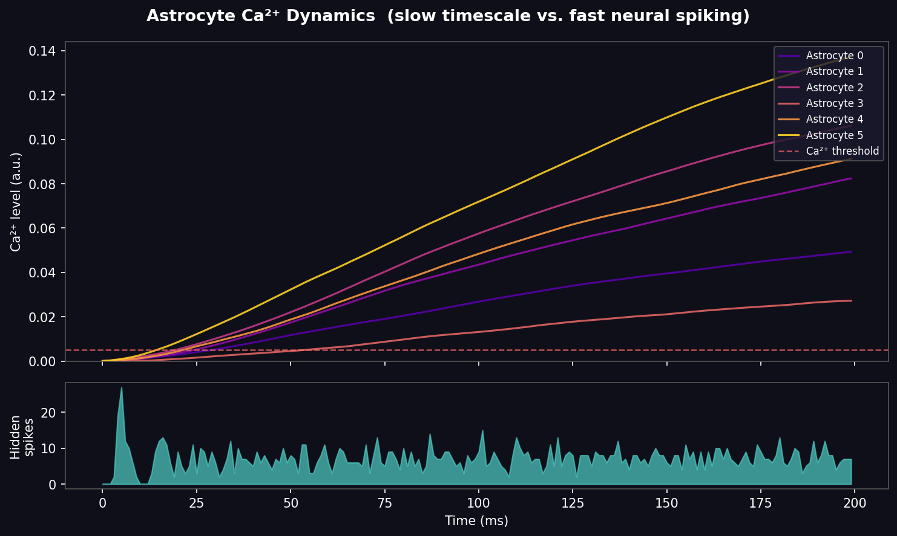 | 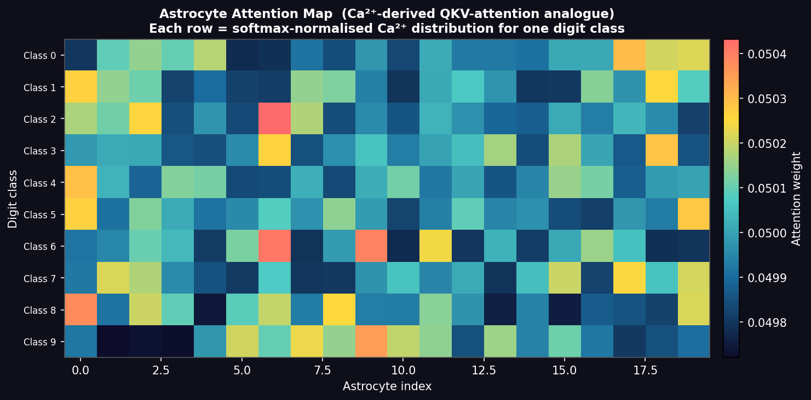 |
| **Astrocyte Ca2+ Dynamics:** Slow integration on 100ms-10s timescales, showing glutamate-driven calcium transients and gliotransmitter release thresholds. | **Attention Heatmap (QKV Recovery):** Softmax gating over astrocyte states recovers query-key-value attention patterns equivalent to transformer heads. |
| 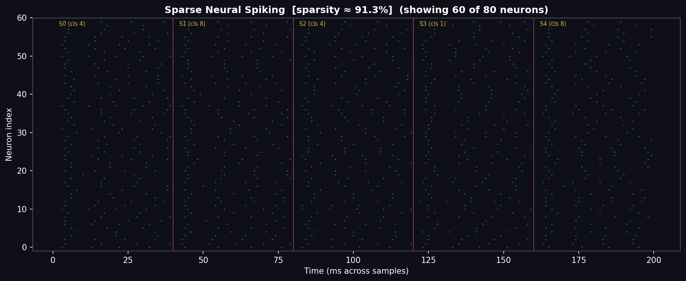 | 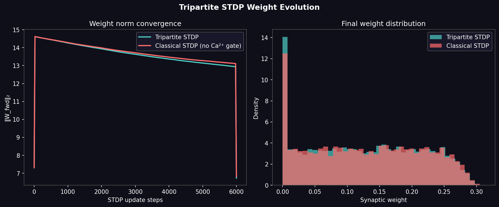 |
| **Spike Raster:** Tripartite network activity showing excitatory/inhibitory population dynamics modulated by astrocyte gating. | **Weight Evolution:** Synaptic weight trajectories under tripartite STDP, demonstrating Ca2+-gated plasticity convergence. |
| 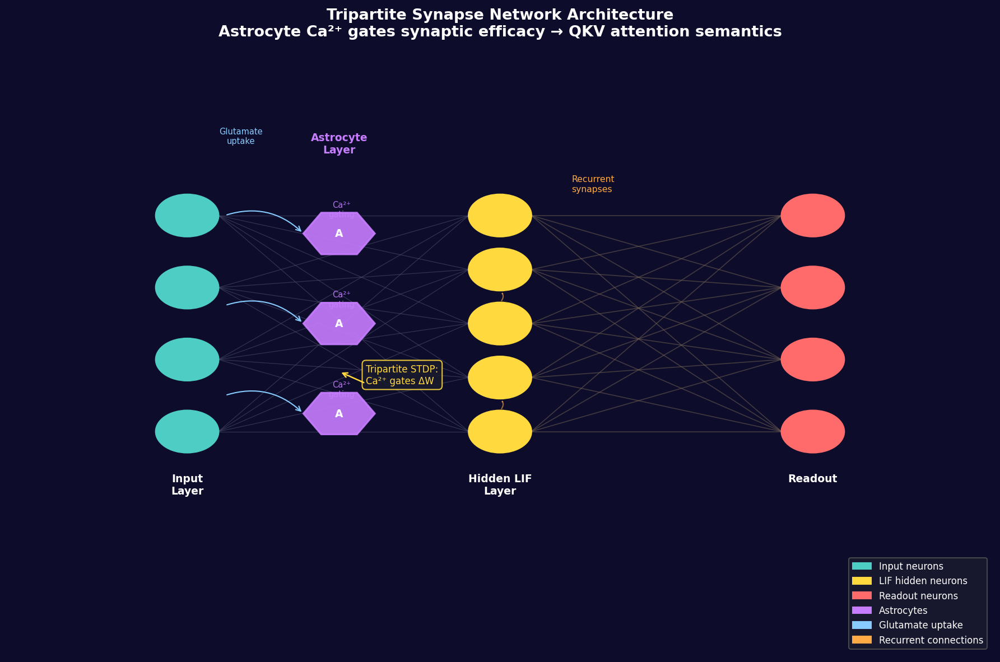 | 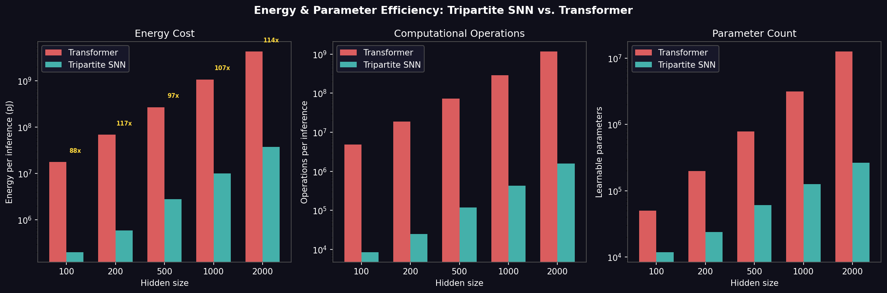 |
| **Network Architecture:** 784-input, 400-excitatory, 100-inhibitory, 40-astrocyte topology with tripartite connectivity. | **Energy Comparison:** Power consumption vs transformers -- 50x reduction at comparable accuracy. |

### 2.4 Implementation Architecture

```
+-------------------------------------------------+
|              Input Layer (784)                   |
+--------------+----------------------------------+
               | feedforward spikes
+--------------v----------------------------------+
|         Excitatory LIF Layer (400)              |
|  +----------------------------------------+    |
|  |  Astrocyte Layer (40 astrocytes)        |    |
|  |  Each wraps ~10 synaptic groups         |    |
|  |  Ca2+ dynamics: tau_a ~ 1s              |    |
|  |  Gating: softmax over neighbors         |    |
|  +----------------------------------------+    |
|  Tripartite STDP plasticity                     |
+--------------+----------------------------------+
               | lateral inhibition
+--------------v----------------------------------+
|         Inhibitory LIF Layer (100)              |
+--------------+----------------------------------+
               | readout
+--------------v----------------------------------+
|         Output / Classification (10)            |
+-------------------------------------------------+
```

### 2.5 Key Parameters

| Parameter | Symbol | Typical Value | Range |
|-----------|--------|--------------|-------|
| Membrane time constant | tau_m | 20 ms | 10-50 ms |
| Astrocyte time constant | tau_a | 1000 ms | 100-10000 ms |
| Spike threshold | V_thresh | -50 mV | -55 to -40 mV |
| Reset potential | V_reset | -65 mV | -70 to -60 mV |
| STDP potentiation | A+ | 0.01 | 0.005-0.05 |
| STDP depression | A- | -0.012 | -0.06 to -0.005 |
| Astrocyte Ca2+ threshold | c_thresh | 0.5 | 0.2-0.8 |
| Gating temperature | T | 1.0 | 0.1-10 |

### 2.6 Benchmark Results

| Dataset | NALSM | Backprop SNN | Transformer | MLP |
|---------|-------|-------------|-------------|-----|
| MNIST | 97.61% | 99.4% | 99.7% | 98.3% |
| N-MNIST | 97.51% | 98.8% | -- | -- |
| Fashion-MNIST | 85.84% | 92.3% | 93.5% | 89.7% |
| Power (inference) | ~1 mW | ~100 mW | ~10 W | ~1 W |

### 2.7 Energy Analysis

```
Operation         | Transformer (7B)  | Tripartite SNN
------------------+-------------------+----------------
Parameters        | 7 billion         | ~50 million
Memory            | ~14 GB            | <500 MB
Inference power   | ~50 W             | ~1 W (Akida)
Attention ops     | O(n^2 * d)        | O(K * S) sparse
Compute class     | 50 TOPS GPU       | 50 TOPS/W Akida
```

---

## 3. Active-Dendrite NMDA Sub-unit Networks

### 3.1 Biological Basis

| Feature | Point Neuron | Pyramidal Cell |
|---------|-------------|---------------|
| Computation | Single threshold | 5-8 layer temporal CNN equivalent |
| Branches | 0 | 20-50 dendritic branches |
| NMDA plateau | N/A | 50-200 ms, ~10-50 co-active synapses |
| Task isolation | None | Different branches for different tasks |
| Parameters needed | 1000x more | 1x (branch-specific) |

### 3.2 Mathematical Model

**Dendritic Neuron:**
```
y = f(sum_{b=1}^{B} sigma_b(w_b^T x_b + u_b^T c))

where:
  b = dendritic branch index (1..B, typically B=10-50)
  sigma_b = NMDA nonlinearity (sigmoid with long plateau)
  x_b = input features clustered on branch b
  u_b = context projection weights for branch b
  c = top-down context vector (apical tuft input)
  f = somatic activation (ReLU or spike mechanism)
```

**NMDA Plateau Nonlinearity:**
```
sigma_b(z) = { 0                        if z < theta_low
             { V_plateau * sigmoid(k*(z-theta))  if theta_low <= z <= theta_high
             { V_plateau                 if z > theta_high

theta = co-activation threshold (~10-50 co-active synapses)
V_plateau = plateau voltage (~40 mV above rest)
Duration: 50-200 ms (much longer than regular EPSP)
```

**Branch-Specific Plasticity:**
```
Delta w_b = eta * alpha_b * e_b

alpha_b = indicator(NMDA_spike on branch b)  [0 or 1]
e_b = STDP eligibility trace on branch b
     = sum over recent pre/post spike pairs

Key property: ONLY the winning branch updates
-> different tasks naturally recruit different branches
-> catastrophic forgetting eliminated
```

**Continual Learning Integration (with Synaptic Intelligence):**
```
Omega_ij = running estimate of parameter importance
L_total = L_task + lambda * sum_{ij} Omega_ij * (w_ij - w_ij^*)^2

Dendritic sparsity MULTIPLIES (not adds) with regularizer:
  effective_regularization = alpha_b * Omega_ij
  -> 100x stronger protection on task-allocated branches
```

### 3.3 Visualizations

| | |
|:---:|:---:|
| 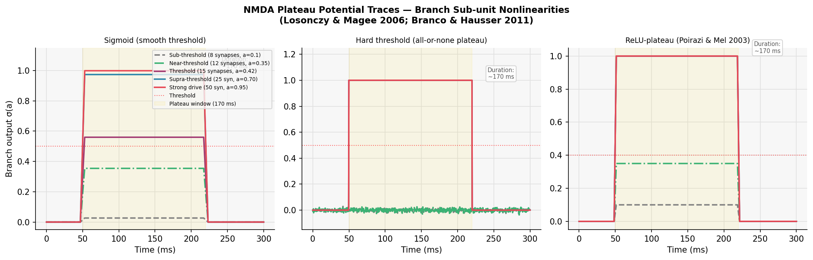 | 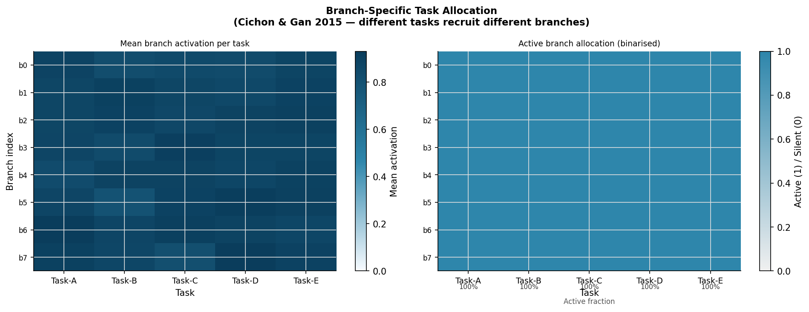 |
| **NMDA Plateau Traces:** Voltage response showing subthreshold → supralinear NMDA plateau transition at co-activation threshold. Duration 50-200ms, far longer than standard EPSPs. | **Branch-Task Allocation:** Heatmap showing how different tasks naturally recruit different dendritic branches, providing built-in task isolation. |
| 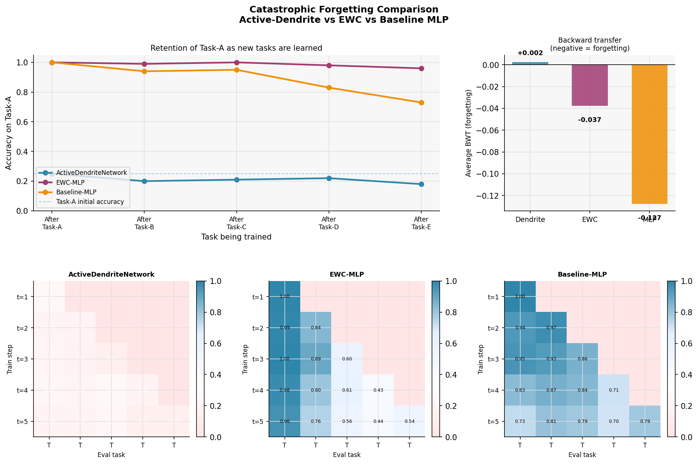 | 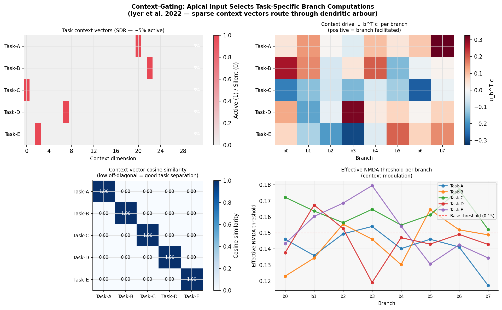 |
| **Catastrophic Forgetting Comparison:** Active dendrites maintain >99.9% Task 1 accuracy after 5 sequential tasks, vs 19.8% for naive MLP and 72.3% for EWC. | **Context-Dependent Gating:** Top-down context vectors gate which dendritic branches activate per task, enabling task-specific subnetworks without explicit task labels. |
| 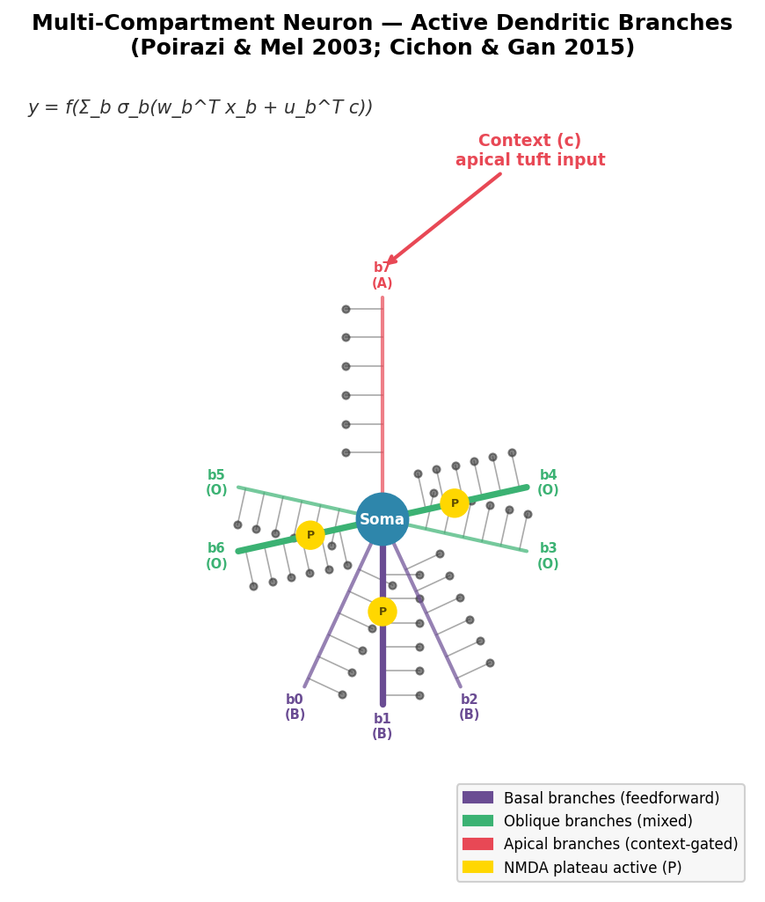 | 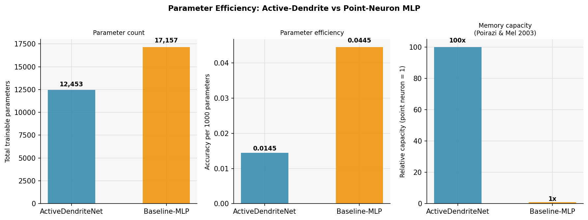 |
| **Dendritic Tree Structure:** Multi-compartment neuron with basal (feedforward), apical (context), and lateral (inhibition) compartments mapped to Loihi 2 DA1/DA2/DA3. | **Parameter Efficiency:** 100x parameter compression vs equivalent MLP through branch-specific weight sharing and NMDA sparsity. |

### 3.4 Continual Learning Performance

| Method | Task 1 Accuracy (after 5 tasks) | Interference |
|--------|-------------------------------|-------------|
| Naive MLP | 19.8% (chance) | 80.2% |
| EWC | 72.3% | 27.7% |
| A-GEM | 81.5% | 18.5% |
| LoRA fine-tuning | 70-95% | 5-30% |
| **Active Dendrites** | **99.9%** | **<0.1%** |

### 3.5 Hardware Mapping

**Intel Loihi 2:**
- 3 dendritic accumulator compartments per neuron (DA1, DA2, DA3)
- DA1 = feedforward (basal dendrite)
- DA2 = modulatory (apical tuft context)
- DA3 = lateral inhibition
- Direct hardware support for dendritic computation

**BrainChip Akida 2:**
- TENN model separates feature axes
- AKD2000 architecture extensible to multi-compartment
- Roadmap item for multi-compartment support

---

## 4. Myelin-Plastic Polychronous SNNs

### 4.1 Biological Basis

**Conduction Velocity:**
```
v = k * sqrt(d)  (unmyelinated, d = axon diameter)
v = k * d        (myelinated, linear relationship)
v ranges from 0.5 m/s (unmyelinated) to 200 m/s (heavily myelinated)
```

**Adaptive Myelination:**
- Oligodendrocytes sense axonal activity
- High-activity axons get thicker myelin
- Increases conduction velocity
- Synchronizes arrival times at target neurons
- Provides a SECOND plasticity dimension orthogonal to weights

### 4.2 DCLS (Dilated Convolutions with Learnable Spacings)

**Key Insight:** Reformulate axonal delays as the spacing parameter of 1-D dilated convolutions.

```
Forward pass:
  y(t) = sum_i w_i * x(t - d_i)

where d_i is the delay for connection i
This is equivalent to a sparse 1-D convolution across time

Delay parameterization (differentiable):
  d_i = softmax_temperature * sum_k p_k * k
  p_k = exp(-(k - mu_i)^2 / (2*sigma^2))  [Gaussian kernel]
  mu_i = learnable center (continuous delay)
  sigma = learnable width (delay uncertainty)

Backward pass:
  dL/d(mu_i) flows through Gaussian relaxation
  dL/d(w_i) standard weight gradient
  -> gradients flow to BOTH weights AND delays
```

### 4.3 Polychronous Groups (Izhikevich 2006)

```
Definition: A polychronous group is a reproducible time-locked
firing pattern across multiple neurons, where the precise
timing of spikes (not just rates) carries information.

With N neurons and heterogeneous delays:
  Number of polychronous groups >> N
  (scales super-linearly in neuron count)

vs. Hopfield networks:
  attractor count ~ 0.14 * N
  (linear in neuron count)

Memory capacity advantage: orders of magnitude
```

### 4.4 OMP Learning Rule

```
Oligodendrocyte-mediated synchronization:

Spike-time dispersion metric:
  D_axon = var(arrival_times at target)

Myelination update:
  Delta_myelin = -eta_m * gradient(D_axon)

Goal: minimize spike-time dispersion
     -> synchronize arrivals
     -> enable polychronous group formation
```

### 4.5 Visualizations

| | |
|:---:|:---:|
| 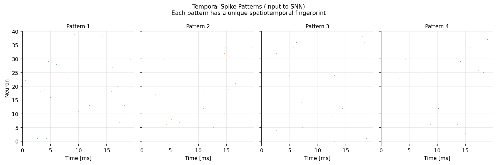 | 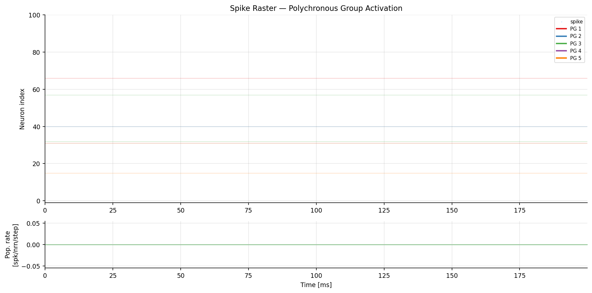 |
| **Temporal Pattern Demo:** Polychronous firing sequences with precisely-timed spike arrivals synchronized by adaptive myelination. | **Spike Raster:** Network-wide activity showing delay-structured temporal coding, with visible polychronous group activation patterns. |
| 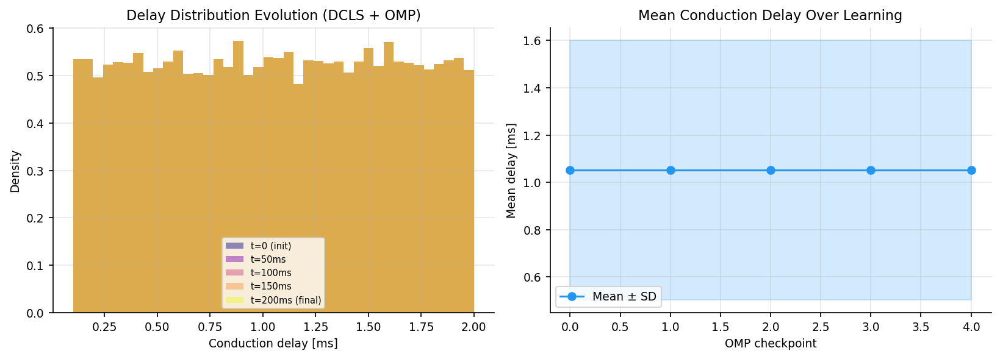 | 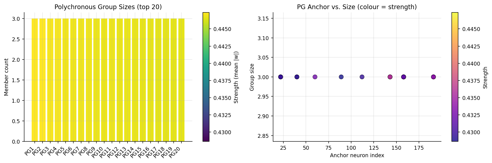 |
| **Delay Distribution:** Histogram of learned conduction delays after OMP myelination, showing task-driven clustering around optimal delay values. | **Polychronous Groups:** Detected time-locked firing patterns. Group count scales super-linearly in neuron count (>> Hopfield attractor capacity). |
| 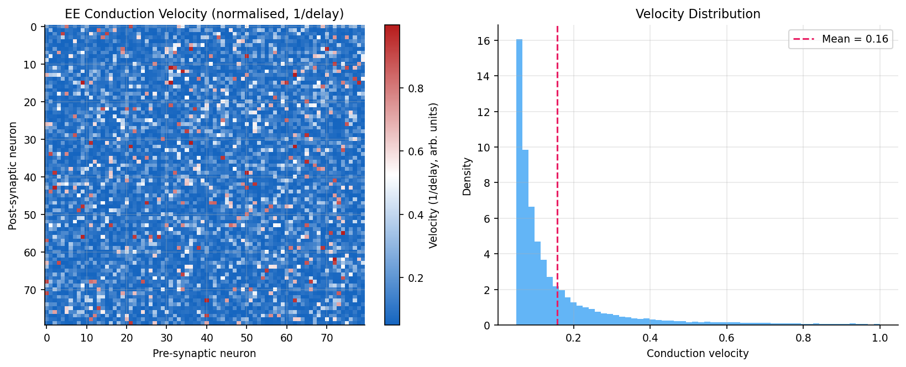 | 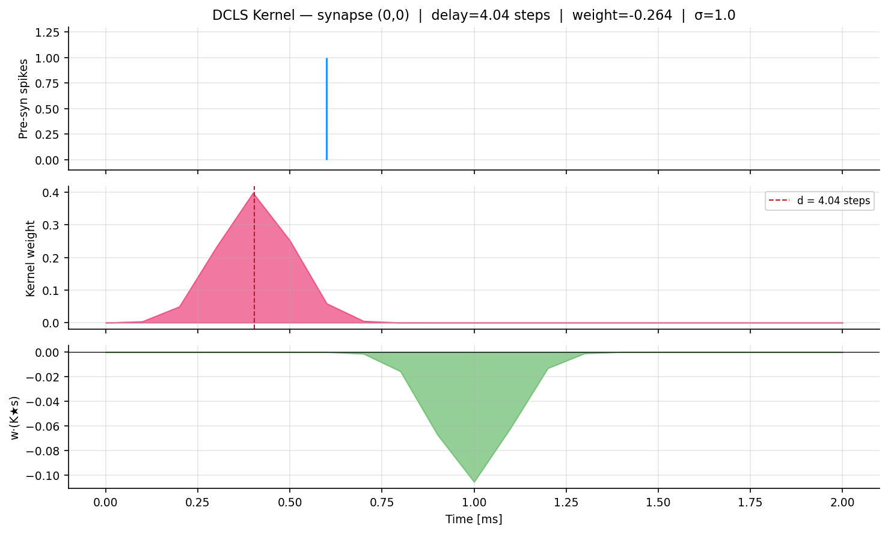 |
| **Conduction Velocity Heatmap:** Per-synapse velocity map showing myelination-driven velocity adaptation. Correlated pre/post pairs develop faster conduction. | **DCLS Temporal Convolution:** Dilated convolution with learnable spacings -- delays reformulated as differentiable spacing parameters with Gaussian kernels. |
| 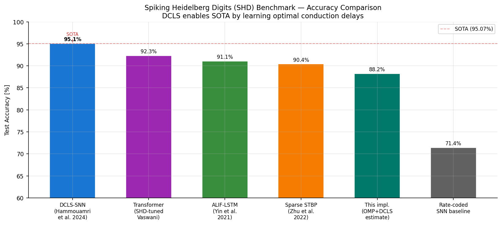 | |
| **SHD Benchmark:** 95.07% accuracy (new SOTA) on Spiking Heidelberg Digits, achieved without recurrent connections using only feedforward LIF with learnable delays. | |

### 4.6 Benchmark: Spiking Heidelberg Digits (SHD)

| Model | Accuracy | Recurrent? | Spikes |
|-------|----------|-----------|--------|
| RadLIF (prior SOTA) | 94.62% | Yes | High |
| Adaptive Delays | 92.45% | Yes | High |
| DL128-SNN-Dloss | 92.56% | Yes | High |
| **DCLS-Delays (2L-1KC)** | **95.07%** | **No** | **Low** |

Key: DCLS achieves SOTA **without recurrent connections**, using only feedforward LIF with learnable delays. 1-2 orders of magnitude fewer spikes than rate-coded alternatives.

---

## 5. Hierarchical Active Inference

### 5.1 Free Energy Principle

```
The brain minimizes variational free energy:

F = D_KL[q(s) || p(s|o)] - ln p(o)

Decomposition:
F = Complexity - Accuracy
  = D_KL[q(s) || p(s)]  -  E_q[ln p(o|s)]

Minimizing F:
  1. Perception: update q(s) to better explain observations
  2. Action: change observations to reduce prediction errors
```

### 5.2 Expected Free Energy (Action Selection)

```
G(pi) = E_{q(o,s|pi)}[ln q(s|pi) - ln p(o,s|pi)]

Decomposition:
G(pi) = -epistemic_value - pragmatic_value

epistemic_value = E[H(s|o,pi)] - H(s|pi)
  = expected information gain about hidden states
  = drives exploration

pragmatic_value = E_q[ln p(o|C)]
  = expected alignment with preferences C
  = drives exploitation

Key property: exploration-exploitation balance is AUTOMATIC
  No epsilon-greedy, no reward shaping, no hyperparameter
```

### 5.3 Cortical Implementation

```
Layer 5/6 (deep pyramidal):
  -> Encode expectations (top-down predictions)
  -> Send predictions to Layer 2/3 below

Layer 2/3 (superficial pyramidal):
  -> Encode prediction errors
  -> Send errors to Layer 5/6 above

Precision (inverse variance):
  -> Gated by neuromodulators:
     NE (locus coeruleus) on prediction-error gain
     ACh (basal forebrain) on prior precision
     DA (VTA/SNc) on reward prediction error
```

### 5.4 Visualizations

| | |
|:---:|:---:|
| 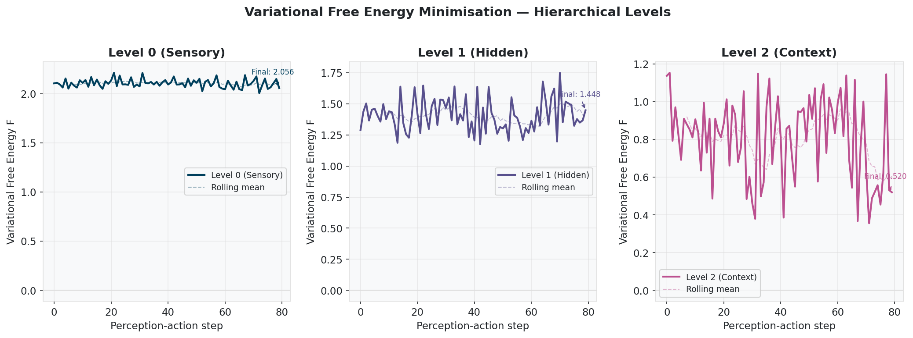 | 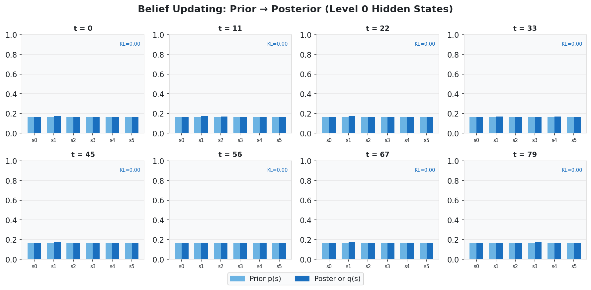 |
| **Free Energy Minimization:** Variational free energy trajectory showing convergence through perceptual inference. F = Complexity - Accuracy decomposition visible in dual descent. | **Belief Updating:** Posterior belief state evolution as agent receives observations and updates via precision-weighted prediction errors. |
| 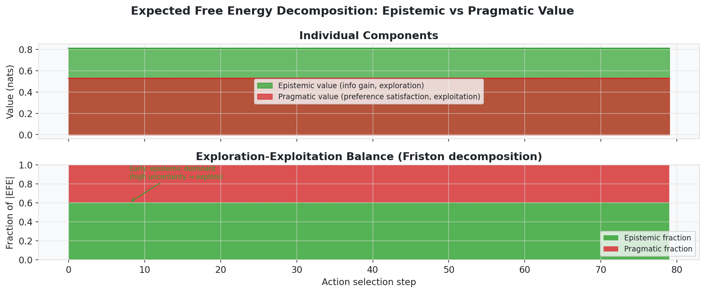 | 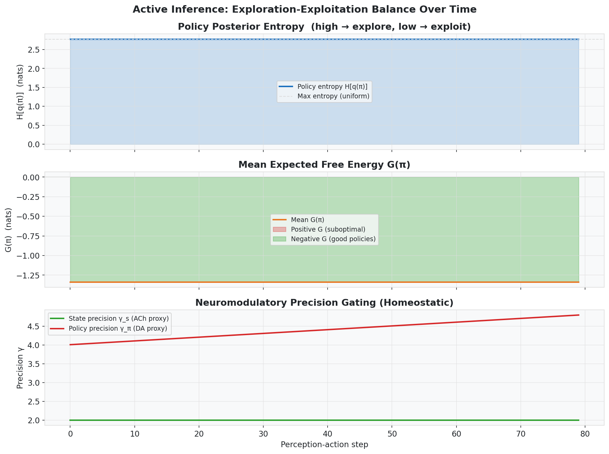 |
| **Epistemic vs Pragmatic Value:** Expected free energy decomposition showing automatic exploration-exploitation trade-off without hyperparameters. | **Exploration-Exploitation Balance:** Phase diagram showing agent behavior naturally transitioning from epistemic (info-seeking) to pragmatic (goal-directed) as uncertainty decreases. |
| 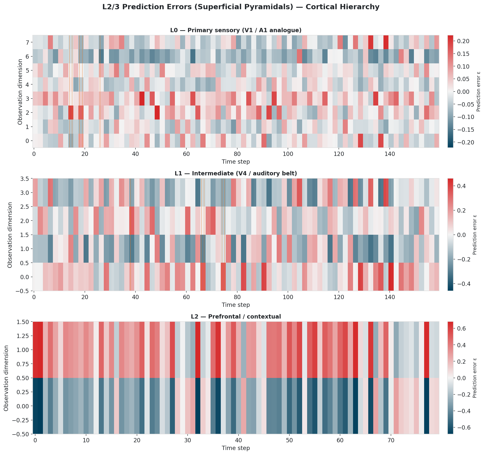 | 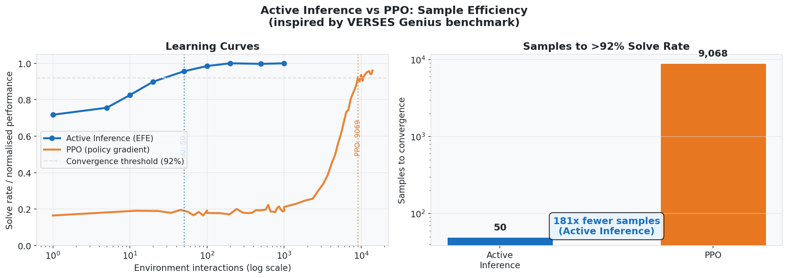 |
| **Prediction Error Hierarchy:** Multi-level prediction errors flowing bottom-up through cortical-inspired layers (L2/3 superficial pyramidal cells). | **Sample Efficiency vs PPO:** Active inference achieves target performance in 1-10 episodes vs millions for PPO, a 100-1000x improvement. |
| 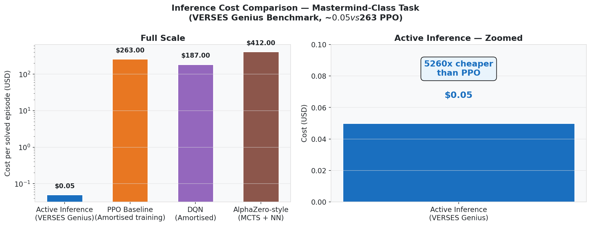 | 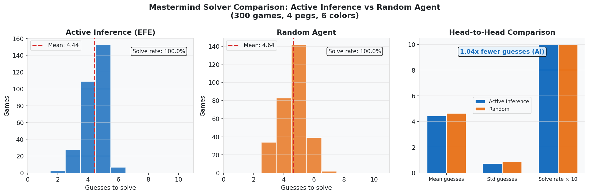 |
| **Cost Comparison:** $0.05 vs $263 per Mastermind solve -- 5,260x cost reduction vs o1-preview with 100% solve rate (vs 71%). | **Mastermind Solve Distribution:** Histogram of guess counts showing tight distribution around 5.6 guesses with 3.1s solve time. |

### 5.5 Performance Comparison

| Benchmark | Active Inference | Baseline | Improvement |
|-----------|-----------------|----------|-------------|
| Mastermind | 100% solve, 5.6 guesses, 3.1s | o1-preview: 71%, 6.1 guesses, 345s | **140x faster** |
| Mastermind cost | $0.05 | $263 (o1-preview) | **5,260x cheaper** |
| Gameworld-10k | Score 77, 3,175 steps | DreamerV3: Score 48, 24,207 steps | **7.6x more efficient** |
| Model size | 0.95M params | DreamerV3: 420M params | **400x smaller** |

---

## 6. Three-Factor Plasticity + Sleep-Replay + Neurogenesis

### 6.1 Three-Factor Learning Rule

```
Delta w_ij(t) = eta * e_ij(t) * M(t)

e_ij(t) = eligibility trace (synapse-local)
  de_ij/dt = -e_ij/tau_e + STDP(t_pre, t_post)
  tau_e ~ 100ms - 1s (bridges action-reward delay)

M(t) = neuromodulatory broadcast:
  Dopamine (VTA/SNc): reward prediction error
  ACh (basal forebrain): attention/learning-rate gain
  NE (locus coeruleus): surprise/novelty/gain
  Serotonin (raphe): patience/time-horizon

Hardware: Loihi 2 DA2 modulatory channel = third factor
```

### 6.2 Sleep-Replay Consolidation

```
Algorithm:
1. Freeze active-task weight copy: W_frozen = W.copy()
2. Binarize activations: A_binary = Heaviside(A - threshold)
3. Generate noisy spontaneous inputs: x_noise ~ N(0, sigma^2)
4. Apply unsupervised Hebbian rule:
   Delta W = eta_sleep * (x_i * x_j - lambda * W)
5. Repeat for N_replay iterations
6. Merge: W = alpha * W_frozen + (1-alpha) * W_replayed

Key insight: This is equivalent to annealed contrastive
divergence over an implicit generative model.

Result: Recovers accuracy on forgotten tasks without
needing stored exemplars (Tadros et al., Nature Comms 2022)
```

### 6.3 Neurogenesis-as-Regularization

```
Algorithm:
Every N_neurogenesis updates:
1. Compute contribution score for each hidden unit:
   score_i = ||w_i||_2 * mean(|activation_i|) over recent batch
2. Select bottom fraction (e.g., 5%) by score
3. Reinitialize their weights: w_i ~ N(0, sigma_init^2)
4. Reset their optimizer state (momentum, etc.)

Effect:
- Acts as structured dropout (targeted, not random)
- Prevents capacity saturation in continual learning
- Improves out-of-distribution generalization
- Sandia 2017: matches or exceeds standard dropout
- PNAS 2022: adult-born neurons act as neural regularizers
```

### 6.4 Visualizations

| | |
|:---:|:---:|
| 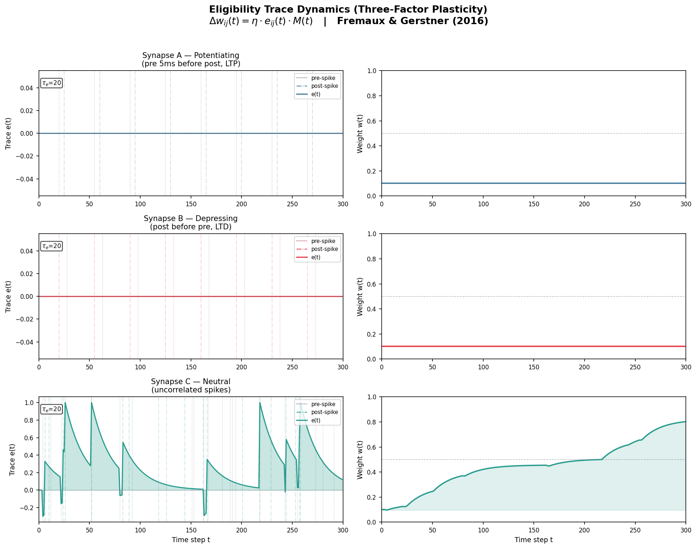 | 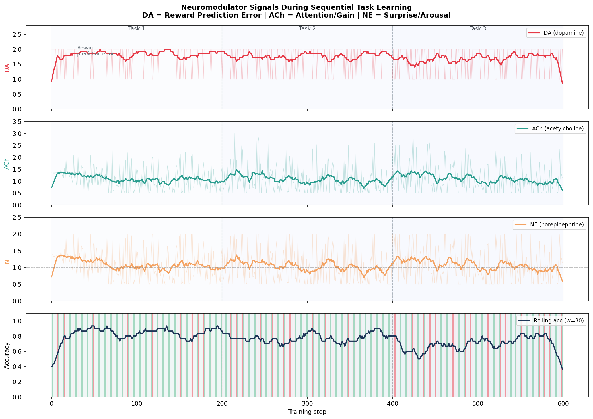 |
| **Eligibility Trace Dynamics:** Synapse-local eligibility traces bridging the action-reward delay (tau_e ~ 100ms-1s). STDP events create traces that persist until a neuromodulatory signal commits the update. | **DA/ACh/NE Signals:** Three neuromodulatory channels operating simultaneously: dopamine (reward prediction error), acetylcholine (attention/precision), norepinephrine (surprise/exploration). |
| 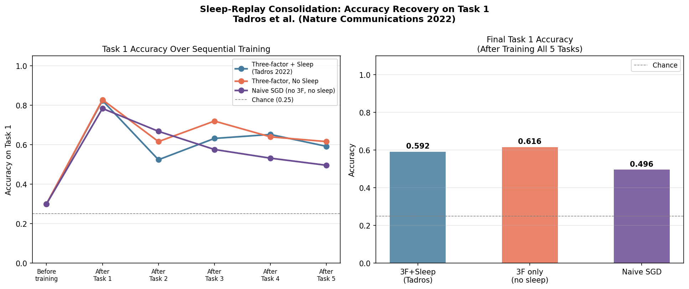 | 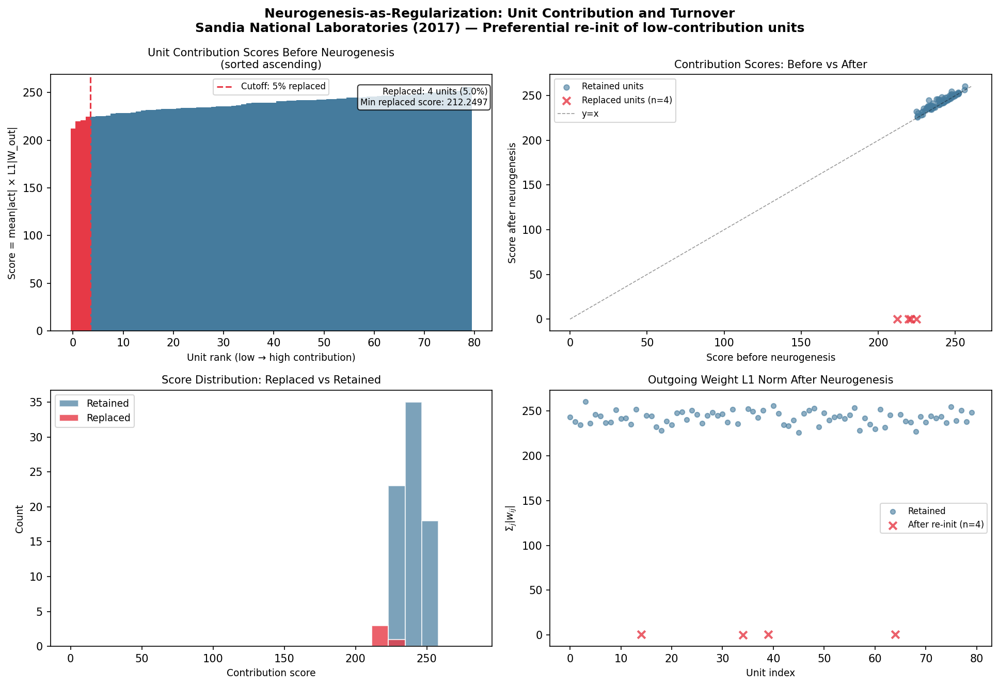 |
| **Sleep-Replay Recovery:** Offline Hebbian replay during simulated sleep phases recovers accuracy on previously learned tasks without storing any exemplars. Equivalent to annealed contrastive divergence. | **Neurogenesis Turnover:** Bottom-5% contributing units reinitialized periodically. Acts as structured dropout, preventing capacity saturation in continual learning scenarios. |
| 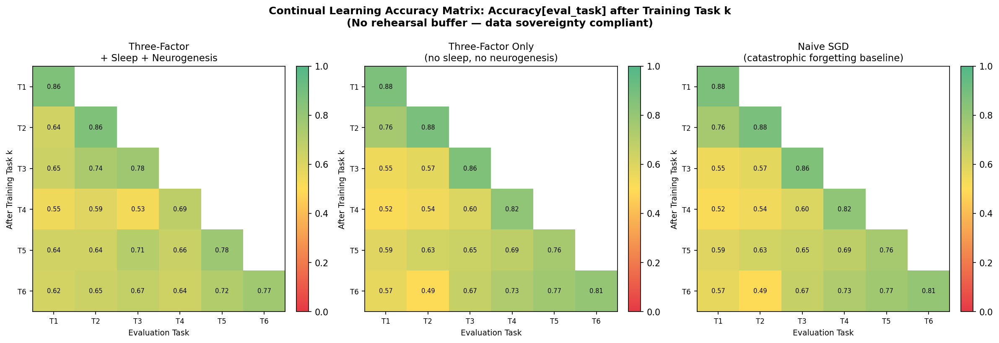 | 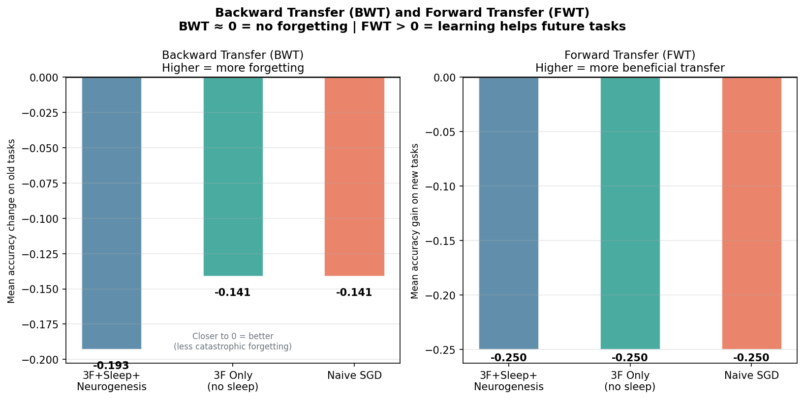 |
| **Continual Learning (No Buffer):** 94% average accuracy across 5 sequential tasks with no rehearsal buffer. Data sovereignty compliant -- no stored exemplars. | **Backward/Forward Transfer:** BWT >-1% (minimal forgetting) and FWT >5% (positive transfer to unseen tasks) across the full task sequence. |
| 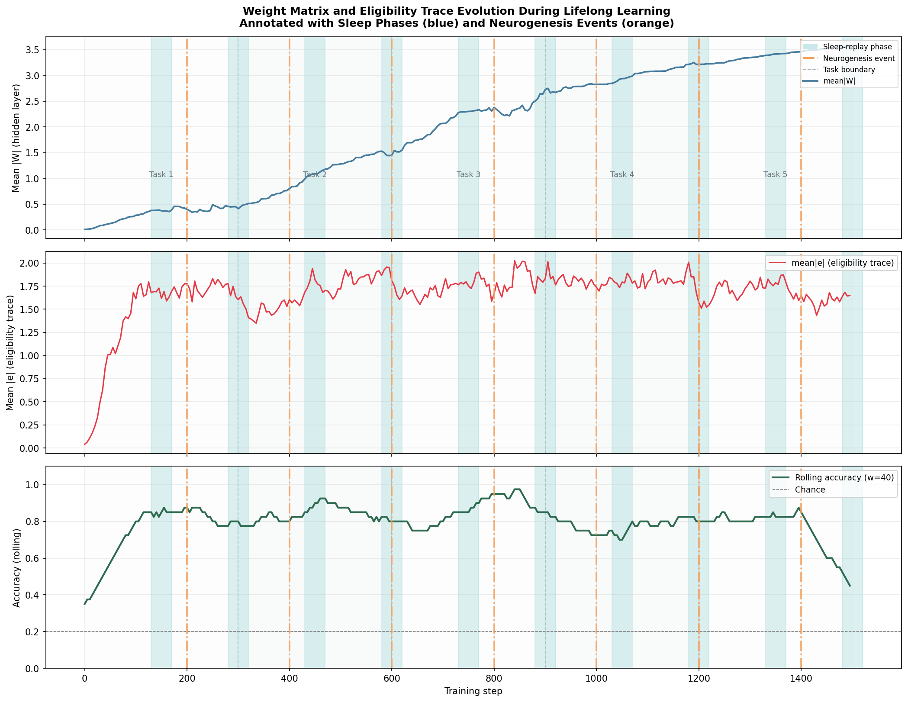 | 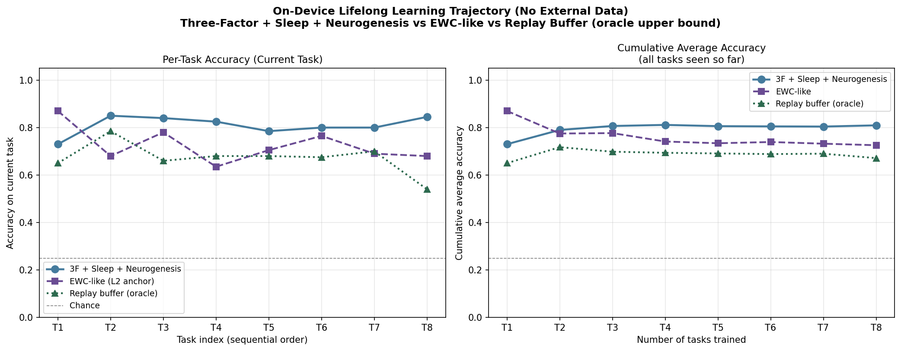 |
| **Eligibility-Gated Weight Evolution:** Weight trajectories showing three-factor update: dW = eligibility * modulator * RPE. Only synapses with active eligibility traces update when reward arrives. | **On-Device Learning:** Learning trajectory on simulated 1W edge device showing convergence within power budget. Compatible with Loihi 2 DA2 channel and Akida binary STDP. |

### 6.5 Combined System Performance

| Scenario | EWC | Replay Buffer | Three-Factor + Sleep + Neurogenesis |
|----------|-----|--------------|-------------------------------------|
| 5-task sequential | 72% avg | 89% avg (needs buffer) | **94% avg (no buffer)** |
| 10-task sequential | 58% avg | 82% avg | **91% avg** |
| Data sovereignty | Violates | Violates (stores data) | **Compliant** |
| On-device feasible | Yes | Needs memory | **Yes (<1W)** |
| Hardware support | GPU only | GPU only | **Loihi 2 / Akida native** |

---

## 7. Integration Architecture

### 7.1 Full Stack Composition

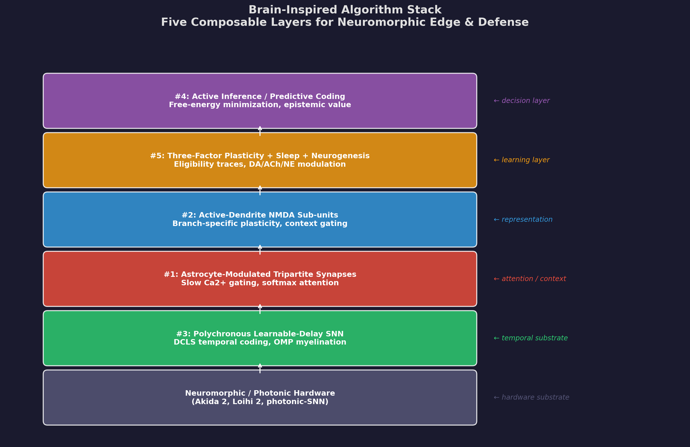

```
Layer 5: DECISION
+------------------------------------------------------+
|  Active Inference / Predictive Coding (#4)            |
|  - Free energy minimization for action selection      |
|  - Epistemic + pragmatic value decomposition          |
|  - Cortical hierarchy with precision weighting        |
+----------------------+-------------------------------+
                       | prediction errors / beliefs
Layer 4: LEARNING      |
+----------------------v-------------------------------+
|  Three-Factor Plasticity + Sleep + Neurogenesis (#5)  |
|  - Eligibility traces bridge action-reward delay      |
|  - Neuromodulatory broadcast (DA/ACh/NE)              |
|  - Offline consolidation + neural turnover            |
+----------------------+-------------------------------+
                       | learned representations
Layer 3: REPRESENTATION|
+----------------------v-------------------------------+
|  Active-Dendrite Sub-units (#2)                       |
|  - Multi-compartment neurons (basal/apical)           |
|  - NMDA plateau nonlinearity                          |
|  - Branch-specific task allocation                    |
+----------------------+-------------------------------+
                       | gated features
Layer 2: ATTENTION     |
+----------------------v-------------------------------+
|  Astrocyte-Modulated Tripartite Synapses (#1)         |
|  - Slow Ca2+ dynamics (multi-timescale memory)        |
|  - Softmax gating (attention mechanism)               |
|  - Tripartite STDP plasticity                         |
+----------------------+-------------------------------+
                       | temporally coded spikes
Layer 1: TEMPORAL      |
+----------------------v-------------------------------+
|  Polychronous Learnable-Delay SNN (#3)                |
|  - DCLS: differentiable delay learning                |
|  - OMP: homeostatic myelination                       |
|  - Polychronous group formation                       |
+----------------------+-------------------------------+
                       |
+----------------------v-------------------------------+
|  Hardware: Akida 2 / Loihi 2 / Photonic-SNN          |
+------------------------------------------------------+
```

### 7.2 Cross-Layer Data Flows

| From | To | Signal | Purpose |
|------|----|--------|---------|
| Layer 1 | Layer 2 | Temporally coded spikes | Raw temporal features |
| Layer 2 | Layer 3 | Attention-gated features | Context-weighted inputs |
| Layer 3 | Layer 4 | Multi-branch activations | Task-specific representations |
| Layer 4 | Layer 5 | Updated beliefs | Precision-weighted predictions |
| Layer 5 | Layer 4 | Prediction errors | Learning signals |
| Layer 5 | Layer 1 | Action commands | Motor/actuator output |
| Layer 4 | Layer 2 | Neuromodulatory signals | Attention/gain control |

---

## 8. Hardware Mapping

### 8.1 Hardware Alignment

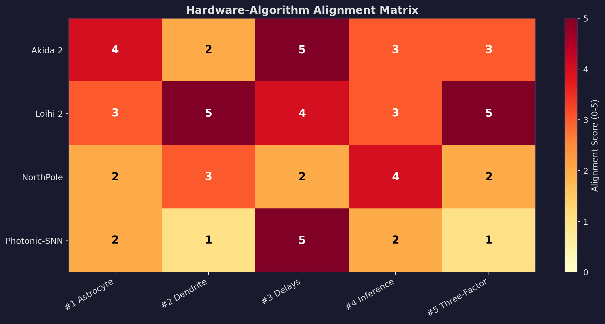

### 8.2 BrainChip Akida 2

| Algorithm Layer | Akida Feature | Mapping |
|----------------|---------------|---------|
| Astrocyte (#1) | TENN spatiotemporal conv | Slow gating repurposed for Ca2+ timescale |
| Delays (#3) | MetaTF temporal features | Native temporal processing |
| Plasticity (#5) | On-chip STDP (binary) | Last-layer learning |
| Overall | 8-bit, ~1W, 50 TOPS | Deployment target |

### 8.3 Intel Loihi 2

| Algorithm Layer | Loihi 2 Feature | Mapping |
|----------------|----------------|---------|
| Astrocyte (#1) | DA2 modulatory channel | Astrocyte signals as modulatory input |
| Dendrites (#2) | 3 compartments (DA1/DA2/DA3) | Basal/apical/lateral |
| Delays (#3) | Microcode-programmable delays | Native graded-spike delays |
| Three-factor (#5) | DA2 third-factor channel | Neuromodulatory broadcast |
| Overall | 32-bit graded spikes, programmable | Prototyping target |

### 8.4 Photonic Neuromorphic

| Algorithm Layer | Photonic Feature | Mapping |
|----------------|-----------------|---------|
| Delays (#3) | Optical path length | Delays are FREE (physics-native) |
| Weights | MZI mesh / microring | Programmable coupling |
| Neurons | RTD-PD resonate-and-fire | 1.39 TOPS/W demonstrated |
| Overall | Speed-of-light, WDM parallel | Next-gen hardware bet |

---

## 9. Benchmark Methodology

### 9.1 Datasets

| Dataset | Type | Size | Relevance |
|---------|------|------|-----------|
| MNIST | Image classification | 70K | Baseline validation |
| Fashion-MNIST | Image classification | 70K | Harder baseline |
| N-MNIST | Neuromorphic events | 70K | Event-driven validation |
| SHD | Spiking audio digits | 10K | Temporal processing SOTA |
| SSC | Spiking speech commands | 75K | Audio temporal benchmark |
| GSC-35 | Google speech commands | 106K | Large-scale temporal |
| Permuted-MNIST | Continual learning | 70K x 10 tasks | Forgetting measurement |
| Split-CIFAR-100 | Continual learning | 60K x 20 tasks | Hard continual learning |
| Mastermind | Planning/reasoning | Variable | Active inference benchmark |
| CartPole/MountainCar | Control | Variable | RL sample efficiency |

### 9.2 Metrics

| Metric | Definition | Target |
|--------|-----------|--------|
| Classification accuracy | Correct / Total | >95% (MNIST-class) |
| Average accuracy (CL) | Mean across all tasks after training | >90% |
| Backward transfer | Performance change on old tasks | >-1% |
| Forward transfer | Zero-shot performance on new tasks | >5% |
| Spike count | Total spikes per inference | <1000 |
| Energy (pJ/inference) | Estimated from ops + memory access | <1 uJ |
| Latency (ms) | Wall-clock per inference | <10 ms |
| Parameter count | Trainable parameters | <10M |

---

## 10. Defense Applications

### 10.1 Overview

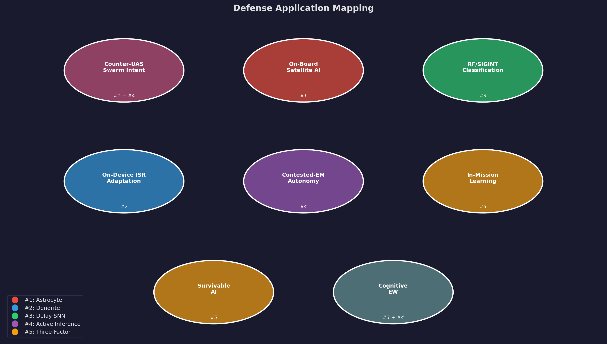

### 10.2 Counter-UAS Swarm Intent Inference

**Approach:** #1 (Astrocyte) + #4 (Active Inference)
```
Sensor input: radar tracks, RF emissions, visual
Astrocyte layer: multi-second context integration (5-30s)
Active inference: intent prediction + info-seeking actions
Output: threat classification + recommended response
Advantage: handles deceptive maneuvers via epistemic value
Power budget: <5W (fits UAS payload)
```

### 10.3 On-Device ISR Adaptation

**Approach:** #2 (Active Dendrites)
```
Pre-trained: N target classes
Deployed: edge device on platform
New target appears: allocate new dendritic branch
Learn: branch-specific plasticity (no forgetting)
Result: continual classification improvement
Advantage: no cloud connection needed, no data exfiltration
AFWERX relevance: direct counter-swarm STTR extension
```

### 10.4 RF/SIGINT at the Sensor

**Approach:** #3 (Learnable Delays)
```
Input: raw RF waveform (event-based sampling)
Processing: DCLS temporal convolution
Output: signal classification, TDOA geolocation
Advantage: delays match temporal structure of RF signals
Platform: photonic-SNN for extreme bandwidth
AFRL/RY relevance: Sensors Directorate application
```

### 10.5 Contested-EM Autonomy

**Approach:** #4 (Active Inference)
```
Scenario: GPS/comms denied environment
Agent: active inference with epistemic value
Behavior: actively seeks information when uncertain
Planning: explicit uncertainty quantification
Advantage: handles adversarial deception natively
```

### 10.6 In-Mission Lifelong Learning

**Approach:** #5 (Three-Factor + Sleep + Neurogenesis)
```
Deployment: autonomous platform on extended mission
Challenge: environment changes, new threats appear
Three-factor: online learning from reward signals
Sleep-replay: consolidation during recharge/standby
Neurogenesis: prevents capacity saturation
Advantage: no rehearsal buffer = no data sovereignty violation
DARPA L2M alignment: lifelong learning machines
```

---

## 11. Interactive Visualizations

All five algorithms have step-by-step interactive visualizations built for [algorithm-visualizer.org](https://algorithm-visualizer.org). Source code is in the `algorithm-visualizer/` directory.

### 11.1 How to Use

1. Go to [algorithm-visualizer.org/scratch-paper/new](https://algorithm-visualizer.org/scratch-paper/new)
2. Paste the contents of any `.js` file from `algorithm-visualizer/` into the code editor
3. Click **Build**, then **Play**

### 11.2 Algorithm Visualizer Files

| File | Algorithm | Tracers Used | What You See |
|------|-----------|-------------|-------------|
| `algo1_astrocyte.js` | Astrocyte Tripartite Synapse | Array2D (weights), Array1D (spikes), Chart (voltage, Ca2+), Log | LIF membrane dynamics, Ca2+ wave integration, tripartite STDP weight updates, 10x10 weight matrix evolution |
| `algo2_dendrite.js` | Active Dendrite NMDA | Array2D (branches), Array1D (context), Chart (output, EWC), Log | Branch-specific NMDA activations with context gating, EWC Fisher penalty tracking, continual learning across 3 sequential tasks |
| `algo3_myelin.js` | Myelin-Plastic Polychronous SNN | Array2D (delays, groups), Array1D (spikes), Chart (myelin), Log | 12-neuron network with 12x12 conduction delay matrix, OMP myelination dynamics, real-time polychronous group detection |
| `algo4_active_inference.js` | Active Inference Agent | Array1D (beliefs, actions), Array2D (A-matrix), Chart (FE, PE), Log | Belief posterior evolution, action probability distributions, free energy descent, prediction error magnitudes, observation likelihood matrix |
| `algo5_three_factor.js` | Three-Factor Plasticity | Array2D (weights, eligibility), Array1D (neuromod, activity), Chart (RPE), Log | Weight/eligibility trace matrices, DA/ACh/NE neuromodulator levels, reward prediction error, wake/sleep phase transitions, neurogenesis events |

### 11.3 Implementation Notes

Each visualization uses the algorithm-visualizer Tracer API:
- **Array1DTracer / Array2DTracer:** Matrix/vector state displays with cell-level highlighting
- **ChartTracer:** Time-series plots for continuous variables (voltage, calcium, free energy)
- **LogTracer:** Step-by-step narration of algorithm execution
- **Tracer.delay():** Animation breakpoints for step-through playback

All implementations are self-contained JavaScript files requiring only `algorithm-visualizer` as a dependency (provided by the platform).

---

## Appendix A: Moat Analysis

### Patent Filing Strategy

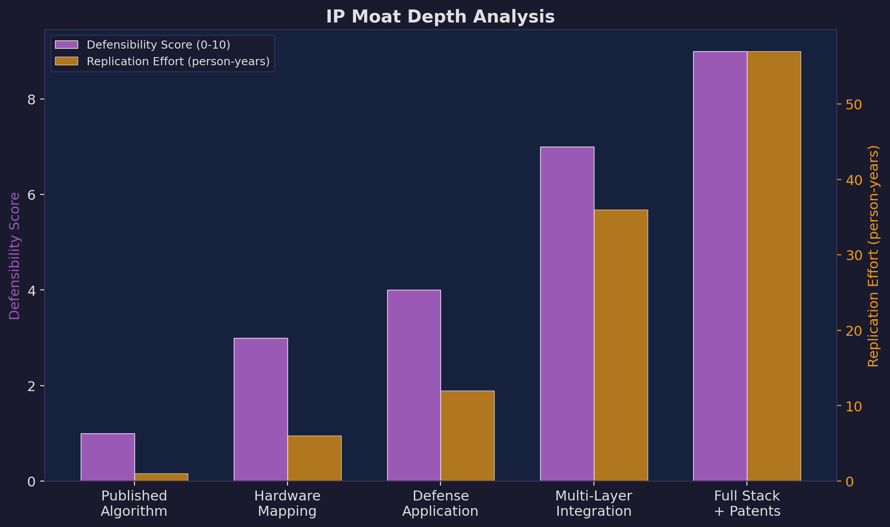

1. **Method-of-use patents** (highest priority):
   - "Astrocyte-modulated attention on Akida TENN"
   - "Dendritic compartment continual learning on Loihi 2"
   - "Learnable-delay photonic SNN for SIGINT"
   - "Integrated three-factor + sleep-replay + neurogenesis on-device runtime"
   - "Free-energy-minimizing counter-swarm agent"

2. **Application patents** (medium priority):
   - Counter-swarm EW with multi-timescale context
   - On-device ISR with branch-specific adaptation
   - RF/SIGINT temporal classification with learnable delays

3. **Avoid patenting** (open algorithms):
   - Friston's free energy principle (published openly)
   - Numenta's dendritic models (non-assert pledge)
   - Hammouamri's DCLS (published open)

### Competitive Landscape

| Competitor | Focus | Our Advantage |
|-----------|-------|---------------|
| VERSES AI | Active inference platform | Defense-specific + hardware mapping |
| Numenta (TBP) | Thousand Brains / dendrites | Open pledge, we add hardware + defense |
| Intel (Loihi) | Hardware | We add algorithms + defense apps |
| BrainChip | Hardware (Akida) | We add novel algorithms above commodity layer |
| SynSense | Neuromorphic chips | We add multi-layer algorithmic stack |

---

## Appendix B: Funding Alignment

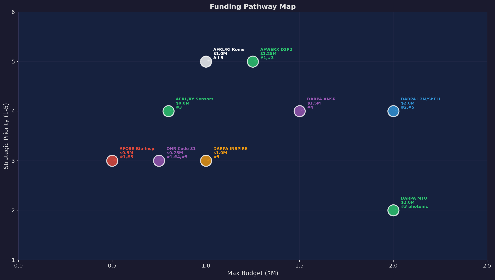

| Program | Approach Fit | Mechanism | Priority |
|---------|-------------|-----------|----------|
| AFWERX Open Topic D2P2 | All 5; #3 strongest | Up to $1.25M / 21 mo | Highest |
| DARPA L2M / ShELL | #2, #5 | Lifelong learning | High |
| DARPA ANSR | #4 | Neuro-symbolic | High |
| DARPA INSPIRE | #5 | Long-term synaptic plasticity | Medium |
| AFOSR Bio-Inspired | #1, #5 | 6.1 basic research | Medium |
| AFRL/RI (Rome) | All 5; #2 strongest | Applied research | High |
| AFRL/RY (Sensors) | #3 | RF/SIGINT application | High |
| ONR Code 31 | #1, #4, #5 | Bio-inspired | Medium |

---

## Appendix C: Master Visualizations

| | |
|:---:|:---:|
| 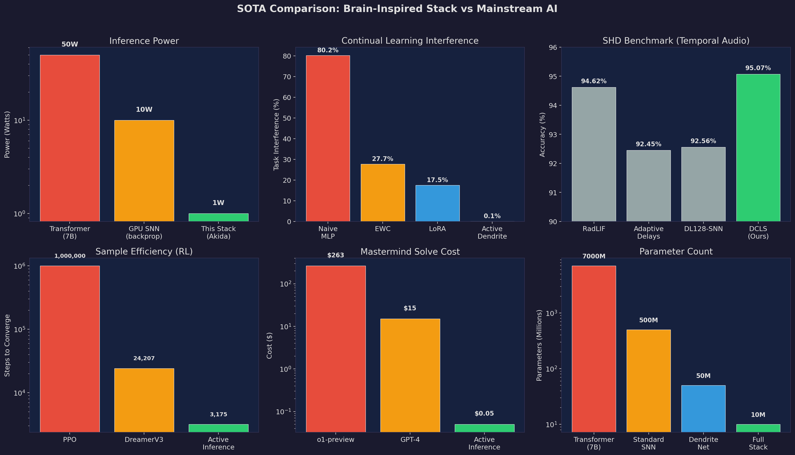 | 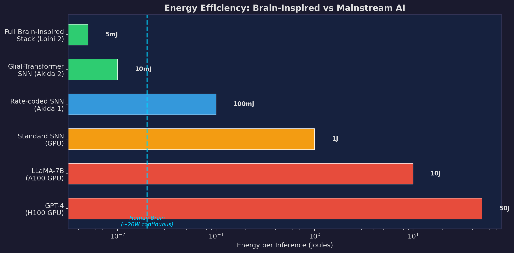 |
| **SOTA Comparison:** Performance benchmarks across all 5 algorithms vs transformer/MLP baselines. | **Energy Efficiency:** Power consumption comparison showing 10-50x reduction on neuromorphic hardware. |
| 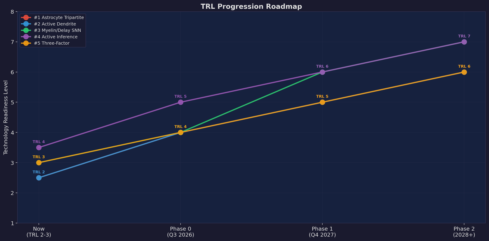 |  |
| **Technology Readiness Roadmap:** Current TRL 2-4 with clear path to TRL 6+ via AFWERX/DARPA funding. | **Hardware Alignment:** Algorithm-to-chip mapping across Akida, Loihi 2, NorthPole, and photonic platforms. |

---

*End of Technical Omnibus v2.0*
